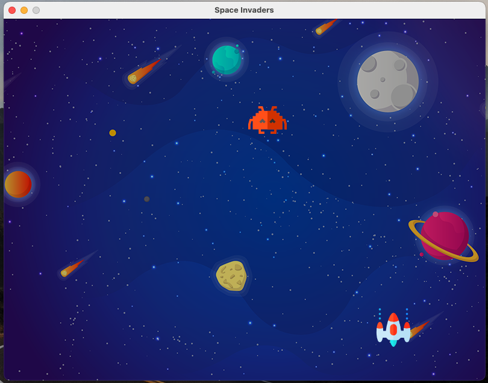

# Project Title: Space Invaders Game (WORK-IN-PROGRESS)

- Screenshot:

## What is the project?

The aim of this project is to use py game library to create a Space Invader Game.

## Tech Stack / Dependencies

- Python 3

- py game library

URL: https://www.pygame.org/wiki/about

- Pycharm IDE

## What is the MVP?

The minimal viable product is a game, where the users goal is to defeat wave after wave of descending aliens with a horizontally moving laser attached to a spaceship.

## What are the sprinkles (Nice to haves)?

## When will the project be complete?

The project will be complete once all the MVP features have been implemented and the game has been styled.

## Adapted from:

Name: Attreya Bhatt 

Project Name: Space-Invaders-Pygame 

Youtube: https://www.youtube.com/watch?v=FfWpgLFMI7w

Github: https://github.com/attreyabhatt/Space-Invaders-Pygame
